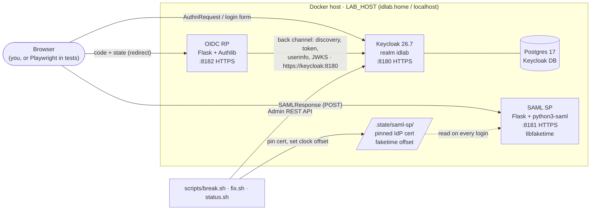

# identity-lab

A self-contained SSO lab you can break on purpose. A Keycloak identity provider and two sample apps (one SAML, one OIDC) run in Docker Compose. One-command scenarios reproduce real single sign-on failures, and each scenario has a support-style runbook for diagnosing and fixing it.

## The problem this solves

When enterprise SSO breaks, the support engineer usually sees only the customer's description: *"SSO stopped working for everyone"*. The cause is buried in signed XML, token claims, certificates, clocks and two sets of logs owned by different teams.

This lab makes those failures **reproducible and safe to practise on**:

- **Break it:** `scripts/break.sh <scenario>` puts the lab into a realistic failure, such as an expired IdP certificate, a skewed clock or a mismatched redirect URI.
- **See it as the customer does:** the apps show the exact error a user would see. Their debug pages show the decoded SAML assertion or ID token.
- **Diagnose it as support would:** every scenario has a runbook covering the symptom, where to look, diagnosis, fix, prevention, and the questions to ask the customer.
- **Prove it:** `scripts/test.sh` runs a real headless-browser login against each app, breaks every scenario, asserts the user-facing error and the log evidence, fixes it, and asserts recovery. CI runs the same script.

## Architecture



- **Front channel:** browsers reach everything at `https://$LAB_HOST:818x`. Keycloak issues tokens with that issuer.
- **Back channel:** the OIDC RP talks to Keycloak directly over the compose network (`KC_HOSTNAME_BACKCHANNEL_DYNAMIC`). The same images therefore work with `LAB_HOST=idlab.home` on a LAN and `LAB_HOST=localhost` in CI.
- **SP trust:** the SAML SP doesn't fetch IdP metadata. Like most SaaS service providers, it trusts the IdP certificate pinned at onboarding (`scripts/pin-idp-cert.sh`).

## Quick start

**Prerequisites:** Linux with Docker Engine and Compose v2, plus `bash`, `openssl`, `curl` and `jq`. It uses host ports 8180–8182.

```bash
git clone <this repo> identity-lab && cd identity-lab

scripts/setup.sh                 # CA, certificates and random secrets -> .env and certs/ (prints no secrets)
                                 # set LAB_HOST=localhost first if you have no DNS name for this machine
docker compose up -d --wait      # Keycloak + Postgres + both apps (first build takes a few minutes)
scripts/pin-idp-cert.sh          # "onboard" the SAML SP: trust the IdP's current signing certificate
scripts/status.sh                # service health and the live state of every scenario
```

### Open the apps: HTTPS only

Use a browser on a machine that resolves `LAB_HOST` to the lab host. **Every URL is `https://`.** There is no plain-HTTP listener and no redirect, so `http://` URLs don't work.

| Service | URL |
|---|---|
| Keycloak (IdP); admin console at `/admin/` | **https://idlab.home:8180** |
| SAML service provider | **https://idlab.home:8181** |
| OIDC relying party | **https://idlab.home:8182** |

If you set a different `LAB_HOST`, use that instead of `idlab.home`.

Sign in to the apps as `alice`, `bob` or `carol`. They share one password; to see it on your own screen, run `grep '^DEMO_PASSWORD=' .env | cut -d= -f2`. The Keycloak admin console user is `admin`. To see its password on your own screen, run `grep '^KC_ADMIN_PASSWORD=' .env | cut -d= -f2`.

#### The certificate warning is expected

The first time you open each URL, the browser warns *"Your connection is not private"* (`NET::ERR_CERT_AUTHORITY_INVALID` in Chrome and Edge). That's because `setup.sh` created the lab's **own certificate authority**, and your browser has never heard of it. For a lab, it's fine to click **Advanced → Continue/Proceed**.

Accept the warning on all three URLs **before** you first log in. Otherwise the hand-off from Keycloak back to an app can stop at a warning page. If that happens, accept it and start the login again. Private/incognito windows ask again.

#### Don't install the lab CA as trusted on your computer

You could make the warnings go away by importing `certs/ca.crt` into your operating system's or browser's trusted root store. **Don't**, especially on a machine you use for anything else:

- **The CA is not limited to the lab.** It can sign certificates for *any* hostname: your bank, your email, your company's SSO.
- **Its private key isn't protected like a real CA's.** `certs/ca.key` sits unencrypted on the lab server, readable by anyone who gets that user account, a backup or a copy of the repo directory.
- **Together, that means interception.** Anyone with the key could issue certificates your computer would accept silently, and intercept HTTPS traffic without a single warning. Trusting a root on Windows applies system-wide (Edge, Chrome and other apps), not just to this lab.

Clicking through the warning gives exactly the same lab experience without that risk. The automated tests do trust the CA, but only inside a throwaway browser container that's deleted after each run.

If you imported it earlier, remove it:

- **Windows:** `certmgr.msc` → *Trusted Root Certification Authorities* → *Certificates* → delete **identity-lab Local CA**.
- **macOS:** Keychain Access → delete it from the *System* or *login* keychain.

### Break something

```bash
scripts/break.sh clock-skew      # now try the SAML login
scripts/status.sh                # clock-skew  broken  saml-sp clock is +600s vs host ...
scripts/fix.sh clock-skew        # or: scripts/fix.sh --all
```

## Scenarios

| # | Scenario | App | What breaks | What the user sees | Runbook |
|---|---|---|---|---|---|
| 1 | `expired-signing-cert` | SAML | The IdP signing certificate pinned on the SP passes its `notAfter` date | `IdP signing certificate expired on <date>; the SP has no valid IdP certificate pinned` | [01-expired-signing-cert](runbooks/01-expired-signing-cert.md) |
| 2 | `clock-skew` | SAML | The SP's clock runs 10 minutes fast (libfaketime in the SP container only) | `Could not validate timestamp: expired. Check system clock.` | [02-clock-skew](runbooks/02-clock-skew.md) |
| 3 | `redirect-uri-mismatch` | OIDC | The client's registered redirect URI no longer matches what the app sends | Keycloak: `We are sorry... Invalid parameter: redirect_uri` | [03-redirect-uri-mismatch](runbooks/03-redirect-uri-mismatch.md) |

Every scenario is:

- **reproducible:** driven by scripts, with no manual clicking
- **reversible:** `fix.sh` restores a working state
- **idempotent:** `break` and `fix` read the *live* state first (Keycloak Admin API, container clocks, SP trust store), so running either twice is a no-op

## Tests

```bash
scripts/test.sh            # build, start or reuse the lab, run every check
scripts/test.sh --fresh    # also delete the Keycloak database volume first, so the realm is re-imported
scripts/test.sh --down     # stop the lab afterwards
```

The 36 checks cover:

- container health, the OIDC issuer, and both apps over TLS verified against the lab CA
- a real Chromium login to each app
- for every scenario: break (twice), detected as broken, the exact error in the browser, the matching log line, fix (twice), detected as healthy, and a successful login again

Screenshots, page HTML and a full log go to `test-results/`. [`.github/workflows/ci.yml`](.github/workflows/ci.yml) runs the same script on `ubuntu-latest` with `LAB_HOST=localhost`.

## Rotating secrets

```bash
scripts/setup.sh --rotate     # new random value for every secret in .env; certificates untouched
scripts/test.sh --fresh       # recreate the lab with them, then prove it still works
```

`--rotate` replaces `KC_ADMIN_PASSWORD`, `POSTGRES_PASSWORD`, `DEMO_PASSWORD`, `OIDC_CLIENT_SECRET` and the two apps' session keys. It prints none of them.

The second step matters. Postgres, the Keycloak admin account, the demo users and the OIDC client secret only receive their values when the database is first created. `--fresh` deletes the Keycloak database volume and re-imports the realm. That also discards anything you changed by hand in the admin console. Afterwards, look up the new demo password with `grep '^DEMO_PASSWORD=' .env | cut -d= -f2`. Existing browser sessions will no longer work, so sign in again.

When you'd do it:

- **A secret has been seen** somewhere it shouldn't be: a screen share or recording, a screenshot, a chat or support ticket, a terminal transcript, a log, or an AI assistant session.
- **`.env` has left the machine**: copied to another host, a backup or a laptop.
- **Someone no longer needs access**: they had the admin or demo password and shouldn't keep it.
- **Before a demo or handing the lab to someone else**, and periodically as good hygiene.

If a **private key** may have been exposed, especially `certs/ca.key`, rotating `.env` isn't enough. Run `scripts/setup.sh --force` to regenerate the CA, TLS and signing keys as well as the secrets, then `scripts/test.sh --fresh`. Remove the old CA from anywhere you trusted it.

## Repository layout

```
compose.yaml                 Keycloak, Postgres, saml-sp, oidc-rp, tests (profile "test")
keycloak/idlab-realm.json    realm, clients and demo users; secrets injected via placeholders
apps/saml-sp/                Flask + python3-saml service provider
apps/oidc-rp/                Flask + Authlib relying party
scenarios/<name>.sh          detect / break / fix for each scenario
scripts/                     setup, pin-idp-cert, break, fix, status, test, lib
tests/                       Playwright image and e2e.py
runbooks/                    one support runbook per scenario
```

## Design decisions

- **Keycloak in production mode with Postgres**, not `start-dev`. The realm is imported only on first boot. After that, state lives in the database, as in a real deployment. Scenarios change it through the Admin REST API, just as an admin would.
- **HTTPS everywhere, from a local CA.** Recent Keycloak versions have cookie problems over plain HTTP on non-localhost hostnames, and real SSO support happens over TLS. `setup.sh` issues one TLS certificate for `LAB_HOST`, `localhost` and the compose service names. The test browser trusts the CA through Chromium's NSS store rather than ignoring certificate errors.
- **Secrets never leave `.env`.**
  - `setup.sh` generates random values, never prints them, and keeps them on re-runs.
  - Private keys are mode 0600. Containers run as the invoking user's UID so they can still read them.
  - The realm JSON contains only `${PLACEHOLDERS}`.
  - The admin password reaches `curl` on stdin, not in the argument list.
  - `.env`, `certs/` and `.state/` are git-ignored.
- **Scenario state is detected, not remembered.** No flag files. `status.sh` reports what the lab is actually doing, so it also catches drift caused by someone editing Keycloak by hand.
- **Why the SAML SP pins the IdP certificate.** The first design had the SP refresh IdP metadata and Keycloak sign with an expired certificate. Building it showed that Keycloak 26.7 won't do that:
  - It refuses to import an expired certificate (`400 "Certificate is not valid"`).
  - When a certificate lapses, it demotes the key (`Certificate chain ... is not valid anymore, disabling it`) and signs with an auto-generated `fallback-RS256` key.
  - A metadata-refreshing SP follows along and never fails.

  Real outages happen at SPs that pinned the certificate at onboarding, so the SP models that. The scenario installs a certificate that is valid for 20 seconds and lets it expire.
- **python3-saml doesn't check certificate dates.** The SP enforces `notBefore`/`notAfter` on its pinned IdP certificates itself, as many commercial SPs do. The runbook says so.
- **Clock skew without touching the host.** libfaketime is preloaded only in the SP container. It reads its offset from a file on every call, so a scenario can shift the clock without a restart. `FAKETIME_DONT_FAKE_MONOTONIC` is deliberately unset: with libfaketime 0.9.10 it makes Python 3.13's `time.sleep()` fail with `EINVAL`, which crashed gunicorn.
- **lxml and xmlsec are compiled from source** against Debian's libxml2, avoiding the well-known `lxml & xmlsec libxml2 library version mismatch` failure between their binary wheels.
- **Everything is pinned:**
  - images by tag and digest
  - Python packages to fully resolved lock files
  - Debian/Ubuntu packages to exact versions
  - GitHub Actions to commit SHAs

  Each version was at least two weeks old when chosen.
- **Ports 8180–8189 only.** Keycloak also listens on 8180 *inside* its container, and its health endpoint is on the unpublished management port.

## Known limitations

- **Apt pins can break builds.** Debian removes superseded security updates from its mirrors, so a pinned apt version (for example `libxml2 2.9.14+dfsg-1.3~deb12u6`) will eventually fail to install. The fix is to bump the pin, or to build from `snapshot.debian.org`.
- **Single-worker apps.** Each app runs one gunicorn worker with an in-memory store for decoded logins. That's fine for a lab, not for production.
- **Tested platform.** The lab has only been tested on x86_64 Linux.
- **Not production configuration.** Demo users share one password, Keycloak's bootstrap admin is used for the scenario scripts, and the SAML SP doesn't do Single Logout.

## How this was built

This project was built with AI-assisted tooling (Claude Code). I directed the scope, design and review. The assistant wrote much of the code and documentation, and every behaviour claimed here is checked by `scripts/test.sh`. Several design changes, such as the certificate pinning and the libfaketime monotonic-clock workaround, came from tests failing against the real software rather than from the first plan.

## License

[MIT](LICENSE)
